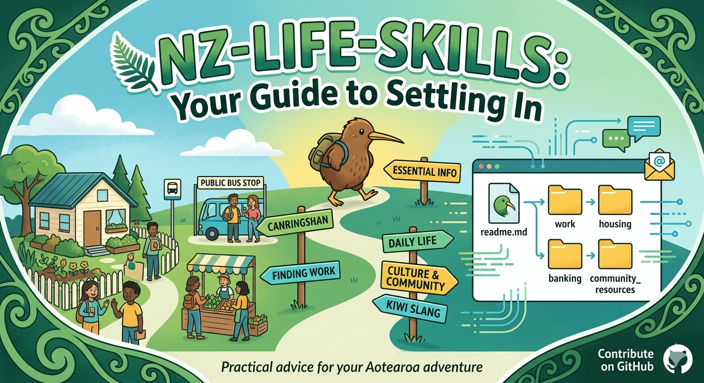

# NZ Life Skills



一个同时面向 Codex 和 Claude Code 的新西兰新来者 onboarding package，重点覆盖国际学生，尤其是中国留学生，在新西兰落地和安顿阶段最常见、最容易卡住的生活问题。

English version: [README.md](./README.md)

文档入口：

- [Package structure](./docs/package-structure.md)
- [Skills index](./docs/skills-index.md)
- [For agents](./docs/for-agents.md)
- [GitHub Pages entry](./docs/index.md)
- [llms.txt](./llms.txt)

## Agent Readiness

这个仓库也暴露了一组可供 agents 发现和接入的机器可读入口：

- 仓库根目录的 [llms.txt](./llms.txt)
- GitHub Pages 站点下的 `robots.txt` 和 `sitemap.xml`
- package manifests: [docs/bundles.json](./docs/bundles.json) 和 [docs/skills.json](./docs/skills.json)
- agent skill index: [docs/.well-known/agent-skills/index.json](./docs/.well-known/agent-skills/index.json)

如果启用了 GitHub Pages，这些入口会出现在站点根目录和 `/.well-known/agent-skills/` 下。

## Package 定位

这个仓库更适合被理解为一个 `New Zealand newcomer onboarding` 能力包，而不是一组彼此无关的零散 skills。

它的目标是：

- 方便外部项目按一个垂直 package 收录
- 方便安装到 Codex 或 Claude Code
- 方便围绕官方来源持续维护

## Bundle 结构

### Arrival Setup

覆盖新到新西兰后第一周最关键的身份、办理和落地事项。

- Kiwi Access Card
- IRD number 申请
- 银行开户
- 手机卡和 eSIM
- 公共交通

### Living Basics

覆盖落地后日常生活的基础问题。

- 租房基础
- 医疗资源使用

### Meta

覆盖这个 package 的分发和可发现性支持。

- repo discoverability

## 这个仓库解决什么问题

这个仓库把新西兰生活中的关键 onboarding 问题整理成可安装、可复用的 skills，并尽量遵循同一原则：

- 优先使用官方网站作为依据
- 当前政策、费用、流程如果可能变化，先联网核实
- 如果官方规则变化，更新 skill reference

## 支持的 Agents

- Codex
- Claude Code

## 仓库结构

```text
skills/
  <skill-name>/
    SKILL.md
    agents/openai.yaml
    references/
scripts/
.claude-plugin/
```

每个 skill 只在 `skills/` 下维护一次。这个仓库可以被当作一个完整 package 使用，也可以按 bundle 方式接入。

## 技能列表

| Skill | 说明 |
|---|---|
| `kiwi-access-card` | 解释 Kiwi Access Card 的资格、线上和线下申请、所需材料、费用和表格问题。 |
| `nz-ird-number` | 解释 IRD number 的申请、用途、常见材料和到达新西兰后的税务初始化问题。 |
| `nz-bank-account` | 解释新西兰银行开户、常见材料、地址证明和日常使用设置。 |
| `nz-mobile-connectivity` | 解释 SIM、eSIM、预付费、套餐选择和落地即用的通信方案。 |
| `nz-public-transport` | 解释不同城市的交通卡、官方 app、机场到住处和学生优惠。 |
| `nz-renting-basics` | 解释租房、flatting、bond、入住检查和租房常见文档。 |
| `nz-healthcare-access` | 解释 GP、urgent care、pharmacy、student health 等医疗入口。 |
| `repo-discoverability` | 帮助改造 GitHub 仓库，让搜索引擎、GitHub 用户和 AI agents 更容易发现它。 |

如果只想先看 package 视角，可直接阅读：[docs/package-structure.md](./docs/package-structure.md)

## 安装到 Codex

### 安装单个 skill

```bash
git clone https://github.com/pengqianhan/NZ-life-skills.git ~/.codex/skill-repos/nz-life-skills
bash ~/.codex/skill-repos/nz-life-skills/scripts/install-codex-skill.sh kiwi-access-card
```

### 安装全部 skills

```bash
git clone https://github.com/pengqianhan/NZ-life-skills.git ~/.codex/skill-repos/nz-life-skills
bash ~/.codex/skill-repos/nz-life-skills/scripts/install-codex-all.sh
```

## 安装到 Claude Code

### 作为 plugin-style 仓库使用

```bash
git clone https://github.com/pengqianhan/NZ-life-skills.git ~/.claude/plugins/nz-life-skills
```

这个仓库包含 `.claude-plugin/plugin.json`，Claude Code 可以把它当作一个以 `./skills` 为根目录的 plugin-style skill collection 使用。

### 安装单个 skill 到 `~/.claude/skills`

```bash
git clone https://github.com/pengqianhan/NZ-life-skills.git ~/.claude/skill-repos/nz-life-skills
bash ~/.claude/skill-repos/nz-life-skills/scripts/install-claude-skill.sh kiwi-access-card
```

### 安装全部 skills 到 `~/.claude/skills`

```bash
git clone https://github.com/pengqianhan/NZ-life-skills.git ~/.claude/skill-repos/nz-life-skills
bash ~/.claude/skill-repos/nz-life-skills/scripts/install-claude-all.sh
```

## 适合谁

这个仓库特别适合：

- 刚到新西兰的国际学生
- 需要一个新西兰 newcomer onboarding bundle 的项目方
- 想给留学生做 AI 助手的人
- 想把本地生活信息结构化成 skills 的维护者
- 需要同时兼容 Codex 和 Claude Code 的使用者

## 官方依据规则

这个仓库中的每个 skill 都应该尽量带有明确的 `Official Sources`：

- 优先使用政府、大学、银行、运营商、交通机构、医疗机构等官方网站
- 不依赖博客、论坛或社交媒体作为主要依据
- 涉及 `current`、`latest`、`today`、价格、资格、流程时，先联网核实再回答

## 贡献方式

欢迎提交：

- 新的 NZ life skills
- 官方来源补充
- README 改进
- 安装脚本优化
- 针对国际学生的新场景补充

贡献说明见：[CONTRIBUTING.md](./CONTRIBUTING.md)
